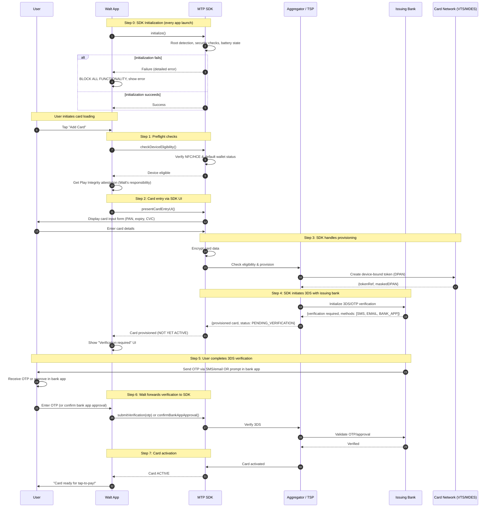

# Card Loading Process

The card loading process is how users add their physical payment cards to Walt for tap-to-pay use. This involves several security steps to ensure the user is authorized to provision the card, and that the card is eligible for tokenization.

**Last Updated**: 2025-11-27

## Overview

Before any card loading can occur, the MTP SDK must be initialized on app launch. The card loading process is then handled primarily by the MTP SDK:

0. **Initialize MTP SDK (every app launch)** — SDK performs device security checks (root detection, security posture, battery state). If this fails, Walt blocks ALL functionality.
1. **Preflight checks** — Walt calls SDK to verify NFC/HCE availability and default wallet status
2. **Card entry via SDK UI** — Walt invokes MTP SDK which presents its own card input UI
3. **SDK handles provisioning** — MTP SDK communicates with aggregator and card network for eligibility/provisioning
4. **Card provisioned (not yet active)** — SDK returns provisioned card to Walt, but card requires 3DS verification
5. **3DS verification** — User completes verification via SMS, email, or bank app
6. **Activation** — Walt sends verification through MTP SDK, which activates the card
7. **Ready for payments** — Card is now active for NFC tap-to-pay

Throughout this process, Walt never handles raw card data (PAN/CVC). The MTP SDK manages card entry, encryption, and all network communication.

## Responsibility Split: SDK vs Walt

| Responsibility | Owner |
|----------------|-------|
| Device security checks (root, battery, security posture) | **MTP SDK** (via `/initialize`) |
| NFC/HCE & default wallet check | **MTP SDK** |
| Card entry UI (PAN, expiry, CVC) | **MTP SDK** (presents its own UI) |
| PAN encryption & transmission | **MTP SDK** |
| Eligibility, provisioning network calls | **MTP SDK** |
| 3DS/OTP initiation with issuing bank | **MTP SDK** |
| Play Integrity attestation | **Walt** |
| Triggering card load flow | **Walt** |
| Forwarding 3DS verification to SDK | **Walt** |
| Success/error UI after SDK returns | **Walt** |

## Sequence Diagram

The following diagram shows the card loading flow where MTP SDK handles card entry, eligibility, provisioning, and the 3DS verification process:



## Key Steps Explained

### 0. SDK Initialization (Every App Launch)

Before any card loading can occur, Walt must initialize the MTP SDK on every app launch:

```kotlin
when (val result = mtpSdk.initialize(context)) {
    is Success -> {
        // Proceed to normal app flow
    }
    is Failure -> {
        // BLOCK ALL APP FUNCTIONALITY
        // Display SDK's detailed error message to user
        showBlockingError(result.error.message)
    }
}
```

**What the SDK checks**:
- Root/jailbreak detection
- Device security posture
- Battery state (anti-fraud measure)
- Other device-level security checks

**What the SDK does NOT check**:
- Play Integrity attestation (Walt's responsibility - see Step 1)

**On failure**: Walt must block ALL functionality and display the SDK error. No card provisioning or payments are allowed on devices that fail security checks.

### 1. Preflight Checks

When user initiates card loading, Walt performs preflight checks:

```kotlin
// SDK checks device eligibility (NFC/HCE, default wallet)
val deviceCheck = mtpSdk.checkDeviceEligibility()

// Walt handles Play Integrity separately
val integrityToken = playIntegrity.requestToken()
```

- **NFC/HCE & default wallet**: SDK verifies device capabilities
- **Play Integrity**: Walt requests attestation token (SDK does NOT handle this)

### 2. Card Entry via SDK UI

Walt invokes the MTP SDK to present its own card entry UI:

```kotlin
// Walt triggers SDK's card entry UI
mtpSdk.presentCardEntryUI(context, callback)

// SDK displays its own UI for PAN, expiry, CVC entry
// Walt never sees or handles the raw card data
```

**Key point**: Walt never handles PAN/CVC. The SDK manages all card data entry, encryption, and transmission.

### 3. SDK Handles Provisioning

The MTP SDK internally:
- Encrypts the card data
- Communicates with the aggregator to check eligibility
- Coordinates with the card network (Visa/Mastercard) to create a device-bound DPAN
- Generates cryptographic keypairs in Android Keystore

### 4. Card Provisioned (Not Yet Active)

After provisioning, the SDK returns a card to Walt with status `PENDING_VERIFICATION`:

```kotlin
// SDK callback
override fun onCardProvisioned(card: ProvisionedCard) {
    // card.status == PENDING_VERIFICATION
    // Card exists but cannot be used for payments yet
    showVerificationRequiredUI(card)
}
```

The card is provisioned but **not yet active**. The user must complete 3DS verification before the card can be used for payments.

### 5. 3DS Verification

The issuing bank sends verification to the user via one of:
- **SMS**: OTP code sent to registered phone
- **Email**: OTP code sent to registered email
- **Bank App**: Push notification to approve in banking app

### 6. Walt Forwards Verification to SDK

Once the user receives and enters the OTP (or approves in bank app), Walt forwards this to the SDK:

```kotlin
// User entered OTP
mtpSdk.submitVerification(otp = userEnteredOtp, callback)

// OR user approved via bank app
mtpSdk.confirmBankAppApproval(callback)
```

The SDK sends verification to the aggregator, which validates with the issuing bank.

### 7. Card Activation

After successful verification, the SDK activates the card:

```kotlin
override fun onCardActivated(card: ActivatedCard) {
    // card.status == ACTIVE
    // Card is now ready for NFC payments
    showSuccessUI("Card ready for tap-to-pay!")
}
```

The card is now **active** and can be used for NFC tap-to-pay transactions.

## Security Considerations

- **SDK device checks**: MTP SDK validates device security (root, battery, security posture) on every app launch
- **Walt never handles PAN/CVC**: SDK provides its own card entry UI; Walt never sees raw card data
- **End-to-end encryption**: Card data is encrypted by SDK before any transmission
- **3DS verification required**: Card cannot be used until user completes bank verification
- **Play Integrity**: Walt separately handles Play Integrity attestation
- **Device binding**: The DPAN is cryptographically tied to the device's hardware-backed keystore
- **Fail-fast on insecure devices**: SDK initialization failure blocks ALL Walt functionality
