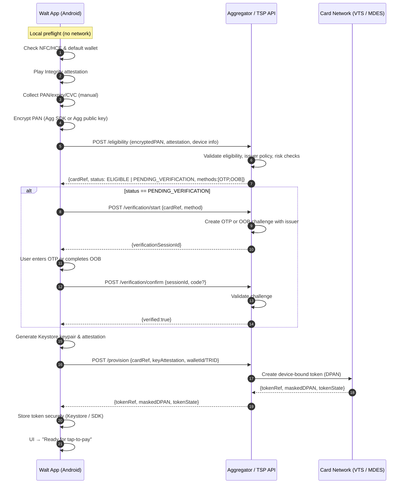

# Card Loading Process

The card loading process is how users add their physical payment cards to Walt for tap-to-pay use. This involves several security steps to ensure the user is authorized to provision the card, and that the card is eligible for tokenization.

## Overview

When a user manually enters their card details (PAN, expiry date, and CVC), Walt coordinates with a payment aggregator to:

1. **Validate eligibility** — Check if the card is supported and the device meets security requirements
2. **Perform step-up verification (if needed)** — Request additional authentication via OTP or out-of-band methods
3. **Provision a device-bound token (DPAN)** — Create a tokenized version of the card that's securely tied to the specific device

Throughout this process, sensitive card data is encrypted and never passes through Walt's servers. All communication happens directly between the Walt app on the user's device and the payment aggregator's API.

## Sequence Diagram

The following diagram shows the optimal manual card load flow, including local preflight checks, eligibility validation, optional verification, and token provisioning:

## Key Steps Explained

### 1. Local Preflight Checks

Before making any network calls, Walt performs local validation:
- **NFC/HCE availability**: Ensures the device supports Host Card Emulation
- **Device attestation**: Uses Play Integrity API to prove device authenticity
- **Data encryption**: Encrypts the PAN using the aggregator's public key or SDK

### 2. Eligibility Check

The app sends the encrypted PAN along with device attestation data to the aggregator's `/eligibility` endpoint. The aggregator:
- Validates the card is eligible for tokenization
- Checks issuer policies and risk parameters
- Returns a card reference and eligibility status

### 3. Step-Up Verification (Conditional)

If the issuer requires additional verification, the aggregator returns a `PENDING_VERIFICATION` status. Walt then:
- Calls `/verification/start` to initiate an OTP or out-of-band challenge
- Prompts the user to complete verification
- Confirms verification via `/verification/confirm`

### 4. Token Provisioning

Once eligibility is confirmed, Walt:
- Generates a cryptographic keypair in Android Keystore (hardware-backed when available)
- Sends the key attestation to the aggregator
- The aggregator coordinates with the card network (Visa Token Service or Mastercard MDES) to create a DPAN
- The DPAN is returned to the app and stored securely in Keystore

### 5. Ready for Payments

The token is now ready for NFC tap-to-pay transactions. The user sees confirmation in the UI, and the DPAN remains securely isolated in the device's trusted execution environment (TEE).

## Security Considerations

- **End-to-end encryption**: PAN data is encrypted on-device before transmission
- **No server-side storage**: Walt never sees or stores unencrypted card data
- **Device binding**: The DPAN is cryptographically tied to the device's hardware-backed keystore
- **Attestation**: Play Integrity and key attestation prove device authenticity to the aggregator
