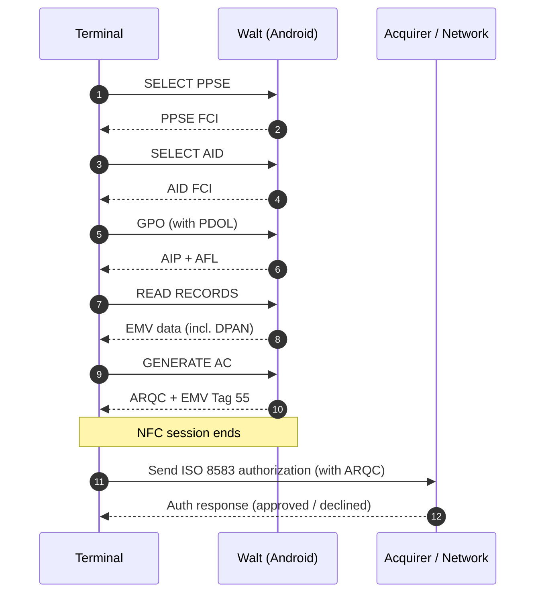

```mermaid
sequenceDiagram
    autonumber
    participant POS as Terminal
    participant WAL as Walt (Android)
    participant NET as Acquirer / Network

    POS->>WAL: SELECT PPSE
    WAL-->>POS: PPSE FCI

    POS->>WAL: SELECT AID
    WAL-->>POS: AID FCI

    POS->>WAL: GPO (with PDOL)
    WAL-->>POS: AIP + AFL

    POS->>WAL: READ RECORDS
    WAL-->>POS: EMV data (incl. DPAN)

    POS->>WAL: GENERATE AC
    WAL-->>POS: ARQC + EMV Tag 55

    Note over POS,WAL: NFC session ends

    POS->>NET: Send ISO 8583 authorization (with ARQC)
    NET-->>POS: Auth response (approved / declined)
```
