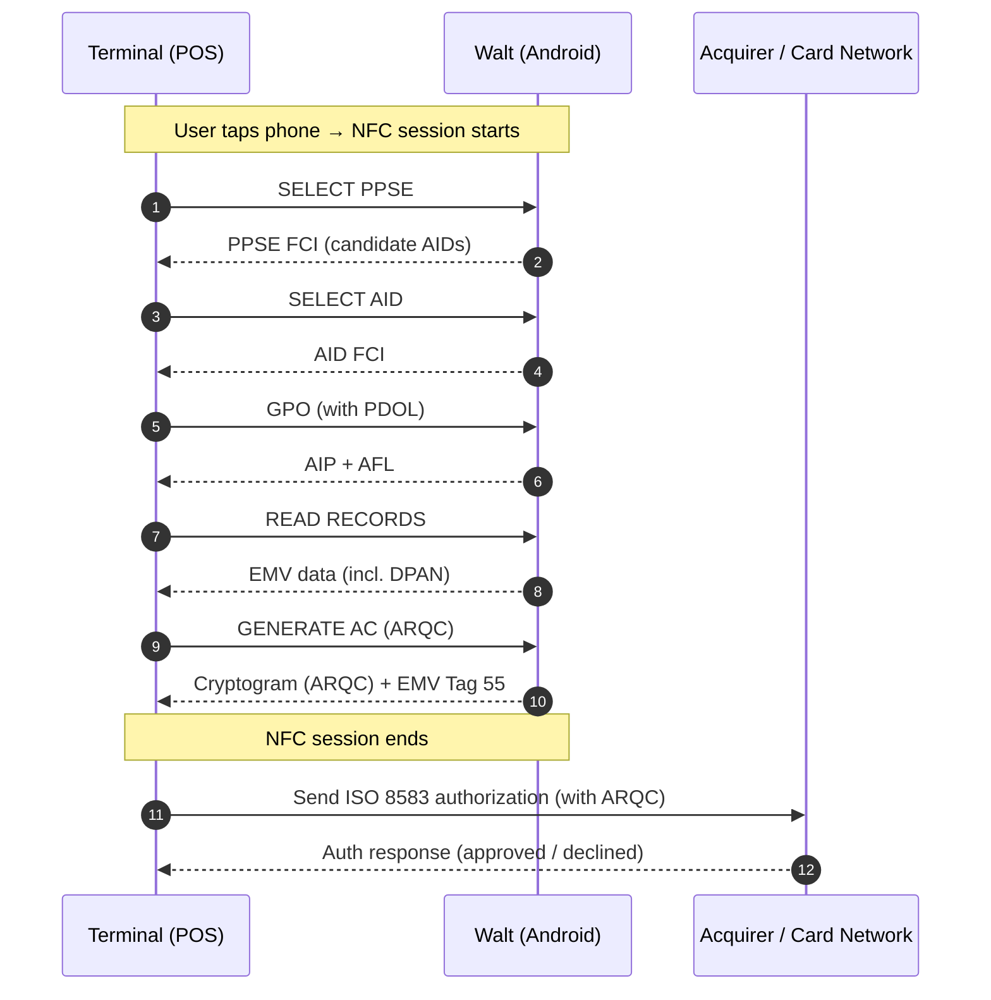

# Card Transaction Process

The card transaction process describes how Walt enables tap-to-pay payments once a card has been successfully tokenized (provisioned with a DPAN). This process focuses on the secure, contactless interaction between the phone and the payment terminal, and how the terminal subsequently communicates with the card network.

## Overview

When the user taps their phone on a payment terminal, Walt emulates a contactless payment card using **Host Card Emulation (HCE)** or a **secure element (SE)**.
The transaction is executed entirely over NFC using **EMV Contactless** protocols — *not REST APIs*.
After the tap, the terminal sends the transaction data to the card network over **ISO 8583**, where authorization and clearing occur.

At no point does Walt communicate with the Internet during the tap itself.
All network calls happen **before** (for key provisioning) or **after** (for synchronization).

## Sequence Diagram

The following diagram shows the high-level sequence between Walt, the terminal, and the payment network during a typical contactless transaction:

